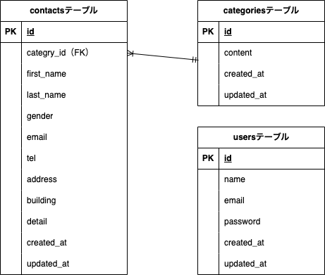

# ContactManagement

お問い合わせフォームアプリケーション

## アプリケーション名

FashionablyLate（フォーム送信管理システム）

## 環境構築

### 前提条件

- Docker/Docker Composeがインストールされていること
- Gitがインストールされていること

### Dockerビルド

1. リポジトリをクローン

```bash
git clone git@github.com:yyuka2000-collab/contact-management.git
cd contact-management
```

2. Dockerコンテナをビルド・起動

```bash
docker-compose up -d --build
```

### Laravel環境構築

1. PHPコンテナに入る

```bash
docker-compose exec php bash
```

2. Composerで依存関係をインストール

```bash
composer install
```

3. 環境変数ファイルを作成

```bash
cp .env.example .env
```

4. アプリケーションキーを生成

```bash
php artisan key:generate
```

5. マイグレーションを実行

```bash
php artisan migrate
```

6. シーディングを実行

```bash
php artisan db:seed
```

## 使用技術（実行環境）

- **PHP**: 8.1
- **Laravel**: 8.0
- **MySQL**: 8.0.26
- **nginx**: 1.21.1

## ER図



## URL

- **開発環境**: http://localhost/
- **管理画面**: http://localhost/admin
- **ユーザー登録**: http://localhost/register
- **ログイン**: http://localhost/login
- **phpMyAdmin**: http://localhost:8080/

## 機能一覧

### ユーザー機能

- お問い合わせフォーム入力
- お問い合わせ内容確認
- お問い合わせ送信完了

### 管理者機能

- 会員登録（Fortify使用）
- ログイン/ログアウト（Fortify使用）
- お問い合わせ一覧表示（ページネーション: 7件/ページ）
- お問い合わせ検索機能
  - 名前検索（部分一致）
  - メールアドレス検索（部分一致）
  - 性別検索
  - お問い合わせ種類検索
  - 日付検索
- お問い合わせ詳細表示（モーダル）
- お問い合わせ削除機能
- CSVエクスポート機能（応用機能）

## テーブル設計

### contactsテーブル

| カラム名   | 型              | PRIMARY KEY | NOT NULL | FOREIGN KEY    | 補足                   |
| ---------- | --------------- | ----------- | -------- | -------------- | ---------------------- |
| id         | bigint unsigned | ○           | ○        |                |                        |
| categry_id | bigint unsigned |             | ○        | categories(id) |                        |
| first_name | varchar(255)    |             | ○        |                |                        |
| last_name  | varchar(255)    |             | ○        |                |                        |
| gender     | tinyint         |             | ○        |                | 1:男性 2:女性 3:その他 |
| email      | varchar(255)    |             | ○        |                |                        |
| tel        | varchar(255)    |             | ○        |                |                        |
| address    | varchar(255)    |             | ○        |                |                        |
| building   | varchar(255)    |             |          |                |                        |
| detail     | text            |             | ○        |                |                        |
| created_at | timestamp       |             |          |                |                        |
| updated_at | timestamp       |             |          |                |                        |

### categoriesテーブル

| カラム名   | 型              | PRIMARY KEY | NOT NULL | FOREIGN KEY | 補足 |
| ---------- | --------------- | ----------- | -------- | ----------- | ---- |
| id         | bigint unsigned | ○           | ○        |             |      |
| content    | varchar(255)    |             | ○        |             |      |
| created_at | timestamp       |             |          |             |      |
| updated_at | timestamp       |             |          |             |      |

**デフォルトカテゴリ:**

1. 商品のお届けについて
2. 商品の交換について
3. 商品トラブル
4. ショップへのお問い合わせ
5. その他

### usersテーブル

| カラム名   | 型              | PRIMARY KEY | NOT NULL | FOREIGN KEY | 補足 |
| ---------- | --------------- | ----------- | -------- | ----------- | ---- |
| id         | bigint unsigned | ○           | ○        |             |      |
| name       | varchar(255)    |             | ○        |             |      |
| email      | varchar(255)    |             | ○        |             |      |
| password   | varchar(255)    |             | ○        |             |      |
| created_at | timestamp       |             |          |             |      |
| updated_at | timestamp       |             |          |             |      |

## ダミーデータ作成

以下のコマンドでダミーデータを作成できます:

```bash
# カテゴリデータ（5件）とお問い合わせデータ（35件）を作成
php artisan db:seed
```

## その他

- 認証機能: Laravel Fortify使用
- バリデーション: FormRequestクラス使用
- パスワード: ハッシュ化済み
- エラーメッセージ: 赤文字表示
- ページネーション: 7件/ページ
- テーブルhover機能実装済み
